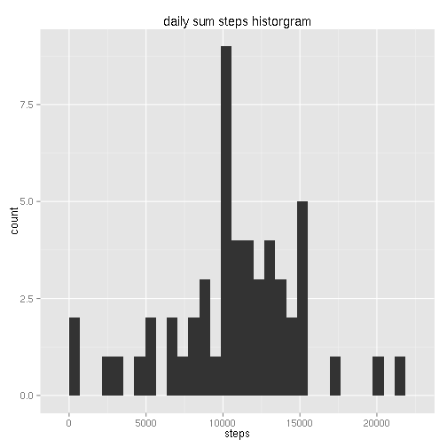
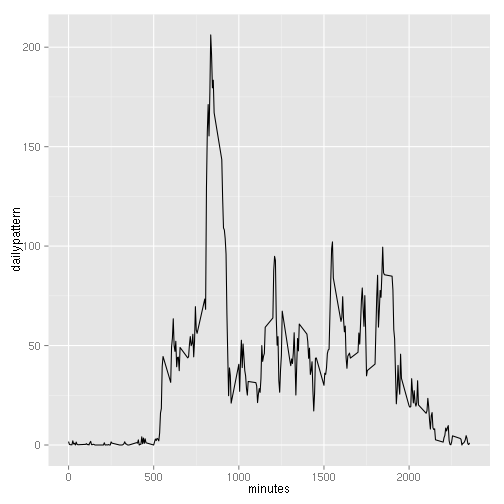
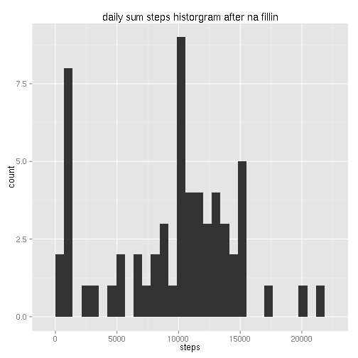
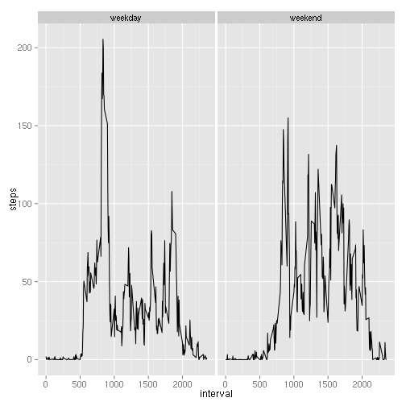

## Loading and preprocessing the data

```r
act <- read.csv('activity.csv', header=T)
#act$date <- as.Date(act$date, "%Y-%m-%d")
```


## What is mean total number of steps taken per day?

```r
library(ggplot2)
library(xtable)
dailysteps <- aggregate(steps ~ date, data=act, sum, na.rm=TRUE)
qplot(steps, data=dailysteps, geom="histogram")+labs(title='daily sum steps historgram')
```

 
### daily mean steps

```r
dailysteps <- aggregate(steps ~ date, data=act, mean, na.rm=TRUE)
print(xtable(dailysteps), type='html', include.rownames=FALSE)
```

<!-- html table generated in R 3.1.2 by xtable 1.7-4 package -->
<!-- Sat Jan 17 00:44:35 2015 -->
<table border=1>
<tr> <th> date </th> <th> steps </th>  </tr>
  <tr> <td> 2012-10-02 </td> <td align="right"> 0.44 </td> </tr>
  <tr> <td> 2012-10-03 </td> <td align="right"> 39.42 </td> </tr>
  <tr> <td> 2012-10-04 </td> <td align="right"> 42.07 </td> </tr>
  <tr> <td> 2012-10-05 </td> <td align="right"> 46.16 </td> </tr>
  <tr> <td> 2012-10-06 </td> <td align="right"> 53.54 </td> </tr>
  <tr> <td> 2012-10-07 </td> <td align="right"> 38.25 </td> </tr>
  <tr> <td> 2012-10-09 </td> <td align="right"> 44.48 </td> </tr>
  <tr> <td> 2012-10-10 </td> <td align="right"> 34.38 </td> </tr>
  <tr> <td> 2012-10-11 </td> <td align="right"> 35.78 </td> </tr>
  <tr> <td> 2012-10-12 </td> <td align="right"> 60.35 </td> </tr>
  <tr> <td> 2012-10-13 </td> <td align="right"> 43.15 </td> </tr>
  <tr> <td> 2012-10-14 </td> <td align="right"> 52.42 </td> </tr>
  <tr> <td> 2012-10-15 </td> <td align="right"> 35.20 </td> </tr>
  <tr> <td> 2012-10-16 </td> <td align="right"> 52.38 </td> </tr>
  <tr> <td> 2012-10-17 </td> <td align="right"> 46.71 </td> </tr>
  <tr> <td> 2012-10-18 </td> <td align="right"> 34.92 </td> </tr>
  <tr> <td> 2012-10-19 </td> <td align="right"> 41.07 </td> </tr>
  <tr> <td> 2012-10-20 </td> <td align="right"> 36.09 </td> </tr>
  <tr> <td> 2012-10-21 </td> <td align="right"> 30.63 </td> </tr>
  <tr> <td> 2012-10-22 </td> <td align="right"> 46.74 </td> </tr>
  <tr> <td> 2012-10-23 </td> <td align="right"> 30.97 </td> </tr>
  <tr> <td> 2012-10-24 </td> <td align="right"> 29.01 </td> </tr>
  <tr> <td> 2012-10-25 </td> <td align="right"> 8.65 </td> </tr>
  <tr> <td> 2012-10-26 </td> <td align="right"> 23.53 </td> </tr>
  <tr> <td> 2012-10-27 </td> <td align="right"> 35.14 </td> </tr>
  <tr> <td> 2012-10-28 </td> <td align="right"> 39.78 </td> </tr>
  <tr> <td> 2012-10-29 </td> <td align="right"> 17.42 </td> </tr>
  <tr> <td> 2012-10-30 </td> <td align="right"> 34.09 </td> </tr>
  <tr> <td> 2012-10-31 </td> <td align="right"> 53.52 </td> </tr>
  <tr> <td> 2012-11-02 </td> <td align="right"> 36.81 </td> </tr>
  <tr> <td> 2012-11-03 </td> <td align="right"> 36.70 </td> </tr>
  <tr> <td> 2012-11-05 </td> <td align="right"> 36.25 </td> </tr>
  <tr> <td> 2012-11-06 </td> <td align="right"> 28.94 </td> </tr>
  <tr> <td> 2012-11-07 </td> <td align="right"> 44.73 </td> </tr>
  <tr> <td> 2012-11-08 </td> <td align="right"> 11.18 </td> </tr>
  <tr> <td> 2012-11-11 </td> <td align="right"> 43.78 </td> </tr>
  <tr> <td> 2012-11-12 </td> <td align="right"> 37.38 </td> </tr>
  <tr> <td> 2012-11-13 </td> <td align="right"> 25.47 </td> </tr>
  <tr> <td> 2012-11-15 </td> <td align="right"> 0.14 </td> </tr>
  <tr> <td> 2012-11-16 </td> <td align="right"> 18.89 </td> </tr>
  <tr> <td> 2012-11-17 </td> <td align="right"> 49.79 </td> </tr>
  <tr> <td> 2012-11-18 </td> <td align="right"> 52.47 </td> </tr>
  <tr> <td> 2012-11-19 </td> <td align="right"> 30.70 </td> </tr>
  <tr> <td> 2012-11-20 </td> <td align="right"> 15.53 </td> </tr>
  <tr> <td> 2012-11-21 </td> <td align="right"> 44.40 </td> </tr>
  <tr> <td> 2012-11-22 </td> <td align="right"> 70.93 </td> </tr>
  <tr> <td> 2012-11-23 </td> <td align="right"> 73.59 </td> </tr>
  <tr> <td> 2012-11-24 </td> <td align="right"> 50.27 </td> </tr>
  <tr> <td> 2012-11-25 </td> <td align="right"> 41.09 </td> </tr>
  <tr> <td> 2012-11-26 </td> <td align="right"> 38.76 </td> </tr>
  <tr> <td> 2012-11-27 </td> <td align="right"> 47.38 </td> </tr>
  <tr> <td> 2012-11-28 </td> <td align="right"> 35.36 </td> </tr>
  <tr> <td> 2012-11-29 </td> <td align="right"> 24.47 </td> </tr>
   </table>
### daily median steps

```r
dailysteps <- aggregate(steps ~ date, data=act, median, na.rm=TRUE)
print(xtable(t(dailysteps)), type='html', include.rownames=FALSE)
```

<!-- html table generated in R 3.1.2 by xtable 1.7-4 package -->
<!-- Sat Jan 17 00:44:35 2015 -->
<table border=1>
<tr> <th> 1 </th> <th> 2 </th> <th> 3 </th> <th> 4 </th> <th> 5 </th> <th> 6 </th> <th> 7 </th> <th> 8 </th> <th> 9 </th> <th> 10 </th> <th> 11 </th> <th> 12 </th> <th> 13 </th> <th> 14 </th> <th> 15 </th> <th> 16 </th> <th> 17 </th> <th> 18 </th> <th> 19 </th> <th> 20 </th> <th> 21 </th> <th> 22 </th> <th> 23 </th> <th> 24 </th> <th> 25 </th> <th> 26 </th> <th> 27 </th> <th> 28 </th> <th> 29 </th> <th> 30 </th> <th> 31 </th> <th> 32 </th> <th> 33 </th> <th> 34 </th> <th> 35 </th> <th> 36 </th> <th> 37 </th> <th> 38 </th> <th> 39 </th> <th> 40 </th> <th> 41 </th> <th> 42 </th> <th> 43 </th> <th> 44 </th> <th> 45 </th> <th> 46 </th> <th> 47 </th> <th> 48 </th> <th> 49 </th> <th> 50 </th> <th> 51 </th> <th> 52 </th> <th> 53 </th>  </tr>
  <tr> <td> 2012-10-02 </td> <td> 2012-10-03 </td> <td> 2012-10-04 </td> <td> 2012-10-05 </td> <td> 2012-10-06 </td> <td> 2012-10-07 </td> <td> 2012-10-09 </td> <td> 2012-10-10 </td> <td> 2012-10-11 </td> <td> 2012-10-12 </td> <td> 2012-10-13 </td> <td> 2012-10-14 </td> <td> 2012-10-15 </td> <td> 2012-10-16 </td> <td> 2012-10-17 </td> <td> 2012-10-18 </td> <td> 2012-10-19 </td> <td> 2012-10-20 </td> <td> 2012-10-21 </td> <td> 2012-10-22 </td> <td> 2012-10-23 </td> <td> 2012-10-24 </td> <td> 2012-10-25 </td> <td> 2012-10-26 </td> <td> 2012-10-27 </td> <td> 2012-10-28 </td> <td> 2012-10-29 </td> <td> 2012-10-30 </td> <td> 2012-10-31 </td> <td> 2012-11-02 </td> <td> 2012-11-03 </td> <td> 2012-11-05 </td> <td> 2012-11-06 </td> <td> 2012-11-07 </td> <td> 2012-11-08 </td> <td> 2012-11-11 </td> <td> 2012-11-12 </td> <td> 2012-11-13 </td> <td> 2012-11-15 </td> <td> 2012-11-16 </td> <td> 2012-11-17 </td> <td> 2012-11-18 </td> <td> 2012-11-19 </td> <td> 2012-11-20 </td> <td> 2012-11-21 </td> <td> 2012-11-22 </td> <td> 2012-11-23 </td> <td> 2012-11-24 </td> <td> 2012-11-25 </td> <td> 2012-11-26 </td> <td> 2012-11-27 </td> <td> 2012-11-28 </td> <td> 2012-11-29 </td> </tr>
  <tr> <td> 0 </td> <td> 0 </td> <td> 0 </td> <td> 0 </td> <td> 0 </td> <td> 0 </td> <td> 0 </td> <td> 0 </td> <td> 0 </td> <td> 0 </td> <td> 0 </td> <td> 0 </td> <td> 0 </td> <td> 0 </td> <td> 0 </td> <td> 0 </td> <td> 0 </td> <td> 0 </td> <td> 0 </td> <td> 0 </td> <td> 0 </td> <td> 0 </td> <td> 0 </td> <td> 0 </td> <td> 0 </td> <td> 0 </td> <td> 0 </td> <td> 0 </td> <td> 0 </td> <td> 0 </td> <td> 0 </td> <td> 0 </td> <td> 0 </td> <td> 0 </td> <td> 0 </td> <td> 0 </td> <td> 0 </td> <td> 0 </td> <td> 0 </td> <td> 0 </td> <td> 0 </td> <td> 0 </td> <td> 0 </td> <td> 0 </td> <td> 0 </td> <td> 0 </td> <td> 0 </td> <td> 0 </td> <td> 0 </td> <td> 0 </td> <td> 0 </td> <td> 0 </td> <td> 0 </td> </tr>
   </table>
## What is the average daily activity pattern?

```r
dailypattern <- tapply(act$steps, act$interval, mean, na.rm=TRUE)
qplot(as.numeric(names(dailypattern)), dailypattern, geom='line', xlab="minutes") 
```

 
### max activity at minutes

```r
names(which.max(dailypattern))
```

```
## [1] "835"
```

## Imputing missing values

```r
library(dplyr)
nona <- sum(is.na(act$steps))
act2 <- act %>%
 group_by(interval) %>%
 mutate(steps=ifelse(is.na(steps), median(steps, na.rm=TRUE),steps)) 
nona2 <- sum(is.na(act2$steps))
```
there are total 2304 rows data contains 'NA'  
and after fillin there are 0

```r
dailysteps <- aggregate(steps ~ date, data=act2, sum)
qplot(steps, data=dailysteps, geom="histogram")+labs(title='daily sum steps historgram after na fillin')
```

 
### daily mean steps

```r
dailysteps <- aggregate(steps ~ date, data=act2, mean, na.rm=TRUE)
print(xtable(dailysteps), type='html', include.rownames=FALSE)
```

<!-- html table generated in R 3.1.2 by xtable 1.7-4 package -->
<!-- Sat Jan 17 00:44:35 2015 -->
<table border=1>
<tr> <th> date </th> <th> steps </th>  </tr>
  <tr> <td> 2012-10-01 </td> <td align="right"> 3.96 </td> </tr>
  <tr> <td> 2012-10-02 </td> <td align="right"> 0.44 </td> </tr>
  <tr> <td> 2012-10-03 </td> <td align="right"> 39.42 </td> </tr>
  <tr> <td> 2012-10-04 </td> <td align="right"> 42.07 </td> </tr>
  <tr> <td> 2012-10-05 </td> <td align="right"> 46.16 </td> </tr>
  <tr> <td> 2012-10-06 </td> <td align="right"> 53.54 </td> </tr>
  <tr> <td> 2012-10-07 </td> <td align="right"> 38.25 </td> </tr>
  <tr> <td> 2012-10-08 </td> <td align="right"> 3.96 </td> </tr>
  <tr> <td> 2012-10-09 </td> <td align="right"> 44.48 </td> </tr>
  <tr> <td> 2012-10-10 </td> <td align="right"> 34.38 </td> </tr>
  <tr> <td> 2012-10-11 </td> <td align="right"> 35.78 </td> </tr>
  <tr> <td> 2012-10-12 </td> <td align="right"> 60.35 </td> </tr>
  <tr> <td> 2012-10-13 </td> <td align="right"> 43.15 </td> </tr>
  <tr> <td> 2012-10-14 </td> <td align="right"> 52.42 </td> </tr>
  <tr> <td> 2012-10-15 </td> <td align="right"> 35.20 </td> </tr>
  <tr> <td> 2012-10-16 </td> <td align="right"> 52.38 </td> </tr>
  <tr> <td> 2012-10-17 </td> <td align="right"> 46.71 </td> </tr>
  <tr> <td> 2012-10-18 </td> <td align="right"> 34.92 </td> </tr>
  <tr> <td> 2012-10-19 </td> <td align="right"> 41.07 </td> </tr>
  <tr> <td> 2012-10-20 </td> <td align="right"> 36.09 </td> </tr>
  <tr> <td> 2012-10-21 </td> <td align="right"> 30.63 </td> </tr>
  <tr> <td> 2012-10-22 </td> <td align="right"> 46.74 </td> </tr>
  <tr> <td> 2012-10-23 </td> <td align="right"> 30.97 </td> </tr>
  <tr> <td> 2012-10-24 </td> <td align="right"> 29.01 </td> </tr>
  <tr> <td> 2012-10-25 </td> <td align="right"> 8.65 </td> </tr>
  <tr> <td> 2012-10-26 </td> <td align="right"> 23.53 </td> </tr>
  <tr> <td> 2012-10-27 </td> <td align="right"> 35.14 </td> </tr>
  <tr> <td> 2012-10-28 </td> <td align="right"> 39.78 </td> </tr>
  <tr> <td> 2012-10-29 </td> <td align="right"> 17.42 </td> </tr>
  <tr> <td> 2012-10-30 </td> <td align="right"> 34.09 </td> </tr>
  <tr> <td> 2012-10-31 </td> <td align="right"> 53.52 </td> </tr>
  <tr> <td> 2012-11-01 </td> <td align="right"> 3.96 </td> </tr>
  <tr> <td> 2012-11-02 </td> <td align="right"> 36.81 </td> </tr>
  <tr> <td> 2012-11-03 </td> <td align="right"> 36.70 </td> </tr>
  <tr> <td> 2012-11-04 </td> <td align="right"> 3.96 </td> </tr>
  <tr> <td> 2012-11-05 </td> <td align="right"> 36.25 </td> </tr>
  <tr> <td> 2012-11-06 </td> <td align="right"> 28.94 </td> </tr>
  <tr> <td> 2012-11-07 </td> <td align="right"> 44.73 </td> </tr>
  <tr> <td> 2012-11-08 </td> <td align="right"> 11.18 </td> </tr>
  <tr> <td> 2012-11-09 </td> <td align="right"> 3.96 </td> </tr>
  <tr> <td> 2012-11-10 </td> <td align="right"> 3.96 </td> </tr>
  <tr> <td> 2012-11-11 </td> <td align="right"> 43.78 </td> </tr>
  <tr> <td> 2012-11-12 </td> <td align="right"> 37.38 </td> </tr>
  <tr> <td> 2012-11-13 </td> <td align="right"> 25.47 </td> </tr>
  <tr> <td> 2012-11-14 </td> <td align="right"> 3.96 </td> </tr>
  <tr> <td> 2012-11-15 </td> <td align="right"> 0.14 </td> </tr>
  <tr> <td> 2012-11-16 </td> <td align="right"> 18.89 </td> </tr>
  <tr> <td> 2012-11-17 </td> <td align="right"> 49.79 </td> </tr>
  <tr> <td> 2012-11-18 </td> <td align="right"> 52.47 </td> </tr>
  <tr> <td> 2012-11-19 </td> <td align="right"> 30.70 </td> </tr>
  <tr> <td> 2012-11-20 </td> <td align="right"> 15.53 </td> </tr>
  <tr> <td> 2012-11-21 </td> <td align="right"> 44.40 </td> </tr>
  <tr> <td> 2012-11-22 </td> <td align="right"> 70.93 </td> </tr>
  <tr> <td> 2012-11-23 </td> <td align="right"> 73.59 </td> </tr>
  <tr> <td> 2012-11-24 </td> <td align="right"> 50.27 </td> </tr>
  <tr> <td> 2012-11-25 </td> <td align="right"> 41.09 </td> </tr>
  <tr> <td> 2012-11-26 </td> <td align="right"> 38.76 </td> </tr>
  <tr> <td> 2012-11-27 </td> <td align="right"> 47.38 </td> </tr>
  <tr> <td> 2012-11-28 </td> <td align="right"> 35.36 </td> </tr>
  <tr> <td> 2012-11-29 </td> <td align="right"> 24.47 </td> </tr>
  <tr> <td> 2012-11-30 </td> <td align="right"> 3.96 </td> </tr>
   </table>
### daily median steps

```r
dailysteps <- aggregate(steps ~ date, data=act2, median, na.rm=TRUE)
print(xtable(t(dailysteps)), type='html', include.rownames=FALSE)
```

<!-- html table generated in R 3.1.2 by xtable 1.7-4 package -->
<!-- Sat Jan 17 00:44:35 2015 -->
<table border=1>
<tr> <th> 1 </th> <th> 2 </th> <th> 3 </th> <th> 4 </th> <th> 5 </th> <th> 6 </th> <th> 7 </th> <th> 8 </th> <th> 9 </th> <th> 10 </th> <th> 11 </th> <th> 12 </th> <th> 13 </th> <th> 14 </th> <th> 15 </th> <th> 16 </th> <th> 17 </th> <th> 18 </th> <th> 19 </th> <th> 20 </th> <th> 21 </th> <th> 22 </th> <th> 23 </th> <th> 24 </th> <th> 25 </th> <th> 26 </th> <th> 27 </th> <th> 28 </th> <th> 29 </th> <th> 30 </th> <th> 31 </th> <th> 32 </th> <th> 33 </th> <th> 34 </th> <th> 35 </th> <th> 36 </th> <th> 37 </th> <th> 38 </th> <th> 39 </th> <th> 40 </th> <th> 41 </th> <th> 42 </th> <th> 43 </th> <th> 44 </th> <th> 45 </th> <th> 46 </th> <th> 47 </th> <th> 48 </th> <th> 49 </th> <th> 50 </th> <th> 51 </th> <th> 52 </th> <th> 53 </th> <th> 54 </th> <th> 55 </th> <th> 56 </th> <th> 57 </th> <th> 58 </th> <th> 59 </th> <th> 60 </th> <th> 61 </th>  </tr>
  <tr> <td> 2012-10-01 </td> <td> 2012-10-02 </td> <td> 2012-10-03 </td> <td> 2012-10-04 </td> <td> 2012-10-05 </td> <td> 2012-10-06 </td> <td> 2012-10-07 </td> <td> 2012-10-08 </td> <td> 2012-10-09 </td> <td> 2012-10-10 </td> <td> 2012-10-11 </td> <td> 2012-10-12 </td> <td> 2012-10-13 </td> <td> 2012-10-14 </td> <td> 2012-10-15 </td> <td> 2012-10-16 </td> <td> 2012-10-17 </td> <td> 2012-10-18 </td> <td> 2012-10-19 </td> <td> 2012-10-20 </td> <td> 2012-10-21 </td> <td> 2012-10-22 </td> <td> 2012-10-23 </td> <td> 2012-10-24 </td> <td> 2012-10-25 </td> <td> 2012-10-26 </td> <td> 2012-10-27 </td> <td> 2012-10-28 </td> <td> 2012-10-29 </td> <td> 2012-10-30 </td> <td> 2012-10-31 </td> <td> 2012-11-01 </td> <td> 2012-11-02 </td> <td> 2012-11-03 </td> <td> 2012-11-04 </td> <td> 2012-11-05 </td> <td> 2012-11-06 </td> <td> 2012-11-07 </td> <td> 2012-11-08 </td> <td> 2012-11-09 </td> <td> 2012-11-10 </td> <td> 2012-11-11 </td> <td> 2012-11-12 </td> <td> 2012-11-13 </td> <td> 2012-11-14 </td> <td> 2012-11-15 </td> <td> 2012-11-16 </td> <td> 2012-11-17 </td> <td> 2012-11-18 </td> <td> 2012-11-19 </td> <td> 2012-11-20 </td> <td> 2012-11-21 </td> <td> 2012-11-22 </td> <td> 2012-11-23 </td> <td> 2012-11-24 </td> <td> 2012-11-25 </td> <td> 2012-11-26 </td> <td> 2012-11-27 </td> <td> 2012-11-28 </td> <td> 2012-11-29 </td> <td> 2012-11-30 </td> </tr>
  <tr> <td> 0 </td> <td> 0 </td> <td> 0 </td> <td> 0 </td> <td> 0 </td> <td> 0 </td> <td> 0 </td> <td> 0 </td> <td> 0 </td> <td> 0 </td> <td> 0 </td> <td> 0 </td> <td> 0 </td> <td> 0 </td> <td> 0 </td> <td> 0 </td> <td> 0 </td> <td> 0 </td> <td> 0 </td> <td> 0 </td> <td> 0 </td> <td> 0 </td> <td> 0 </td> <td> 0 </td> <td> 0 </td> <td> 0 </td> <td> 0 </td> <td> 0 </td> <td> 0 </td> <td> 0 </td> <td> 0 </td> <td> 0 </td> <td> 0 </td> <td> 0 </td> <td> 0 </td> <td> 0 </td> <td> 0 </td> <td> 0 </td> <td> 0 </td> <td> 0 </td> <td> 0 </td> <td> 0 </td> <td> 0 </td> <td> 0 </td> <td> 0 </td> <td> 0 </td> <td> 0 </td> <td> 0 </td> <td> 0 </td> <td> 0 </td> <td> 0 </td> <td> 0 </td> <td> 0 </td> <td> 0 </td> <td> 0 </td> <td> 0 </td> <td> 0 </td> <td> 0 </td> <td> 0 </td> <td> 0 </td> <td> 0 </td> </tr>
   </table>
## Are there differences in activity patterns between weekdays and weekends?

```r
act2$weekdays <- factor(ifelse(weekdays(as.Date(act2$date)) %in% c('Saturday', 'Sunday'), 'weekend', 'weekday'))

#dailypattern <- tapply(act2$steps, list(act2$weekdays,act2$interval), mean, na.rm=TRUE)
dailypattern <- act2 %>%
 group_by(weekdays, interval) %>%
 summarise(steps=mean(steps))

p <- ggplot(dailypattern, aes(x=interval, y=steps))
p <- p + geom_line()
p <- p + facet_wrap(~weekdays)
print(p)
```

 
